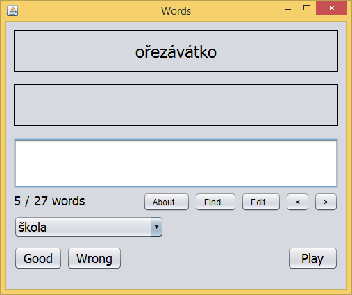

# Words

   

Words is small vocabulary I made for my little schoolgirl. It enables you put in foreign words and sentences, categorize them and download voice pronunciation. 

  
## Features

Vocabulary enables you:

* Organize words and sentences in categories.
* Vocabulary automatically downloads voice pronunciation.
* It supports many languages.
* Application tests little schoolboy/schoolgirl and creates statistics for each particular word. Base on this statistics it sorts words in each category.

## How you can get started with Words

Read project [Wiki](https://github.com/berk76/words/wiki) pages for brief instructions.  
Visit project [Discussions](https://github.com/berk76/words/discussions) where you can ask questions or tell your ideas.  
Follow us at Twitter: [@WordsVocabulary](https://twitter.com/WordsVocabulary)

## How to build project

 1. Download project `git clone https://github.com/berk76/words Words`
 1. Change directory `cd Words`
 1. Build project `mvn assembly:assembly`
 1. Change directory `cd target` and find Words.jar
 1. Create new directory somewhere on your disc. For example `WordsEn` and copy Words.jar in it. 
 1. Run Words application `java -jar Words.jar`

 ## Contributing

All contributions are welcome. :blue_heart:. Please read [CONTRIBUTING.md](.github/CONTRIBUTING.md). :octocat:.
 