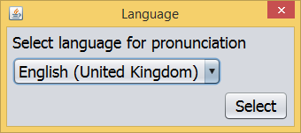
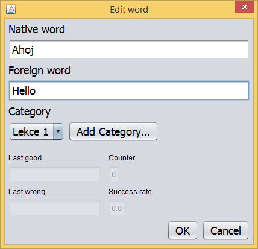
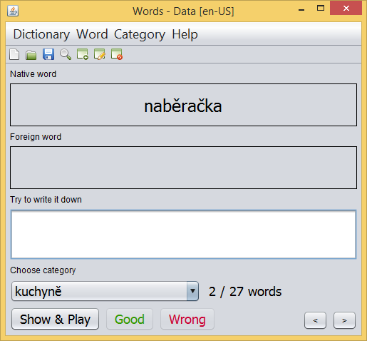

# Program Words

When my daughter started to learn English at school, I made a simple vocabulary for her to enter words and put them in different categories. The dictionary for each word or sentence will download the correct pronunciation from Google. The daughter is thus completely self-sufficient in vocabulary teaching.

Maybe the vocabulary will help someone else.

## 1. How to download and install Words

Words is a Java program that runs on the following operating systems:

* MS Windows
* Linux
* MAC OS

### 1.1 MS Windows

If you use MS Windows on your computer, you can download the installer and install the program. [Download](https://github.com/berk76/words/releases/latest) the latest version of the program - eg. __Words-1.11.0-RELEASE-Installer.exe__. The installer creates an icon on the desktop and launches the program.

### 1.2 Other operating systems

To run Words on your computer, you need to install Java Runtime. If you have Java Runtime installed on your computer, you can download the Words application. [Download](https://github.com/berk76/words/releases/latest) the latest version of the program, such as __Words-1.11.0-RELEASE.jar__. Create a __Words__ directory on your computer and copy the downloaded __Words-1.11.0-RELEASE.jar__ file to it.  

To start the program, double-click the __Words-1.11.0-RELEASE.jar__ file as if you were running any other executable file. Alternatively you can run it from command line `java -jar Words-1.11.0-RELEASE.jar`.

## 2. Use

### 2.1 Running the program for the first time

When you first start up, a dialog will appear on the screen asking you to choose the language for which you want to download the pronunciation. For example, select __English (United Kingdom)__. Each time you enter a new vocabulary in the dictionary, the dictionary will search for English pronunciation.

Subsequently, the main window of the dictionary will appear, which does not yet contain any words. To enter a new word, select __Word__ in the upper left of the menu and select __Add ...__ from the drop-down menu. A dialog box for entering a new word appears. Enter the native word in the __Native word__ field and enter the English word in the __Foreign word__ field. Then choose __Add Category ...__ to create a new category (for example, Lesson 1). Finally, press __OK__ to confirm. The program will warn you that it has no pronunciation for the new word and asks you to download it. Confirm with __yes__.

In this way you can enter additional words and sort them into different categories.

### 2.2 Learning vocabulary

Learning takes place by choosing a category to learn. The native word appears on the screen and the student tells him loudly in English. He may or may not try to write it. Then press the __Show & Play__ button and the English word will appear on the screen while the correct pronunciation will be played. The student then proceeds to the next word with the __Good__ button if he knew correctly, or the __Wrong__ button if he made a mistake. The dictionary then puts the words in categories so that at the beginning there are words with worse score.

 
### 2.3 Other options

Furthermore, it is possible to:

* Search for words __Word - Find__
* Enter new words __Word - Add...__
* Edit vocabulary and change category __Word - Edit...__
* Delete word __Word - Delete__
* Create a new category __Category - Add...__
* Rename category __Category - Rename...__

## 3. Contact

If you encounter a problem that you do not know about, or a program error, you can contact the author at the following email address [jaroslav.beran@gmail.com](mailto:jaroslav.beran@gmail.com).  

## 4. Collaboration

If you are programming and want to add some gadgets to the program, then you are welcome. Make a __Fork__ project and edit and debug the program. Finally, make __Pull request__ and describe your edit in it.
